# RAG_DEMO

一個容器化的 Web 應用，內建 Agentic RAG 聊天機器人，兼具碳管理專業知識與通用問答能力，以 FastAPI、Gradio、Docker 建構。

---

## 如何啟動專案

### 事前準備

- Docker 與 Docker Compose
- Git

### 1. 環境設定

Clone 專案後，在根目錄建立 `.env` 檔案（完整項目請參考 `.env.example`）：

```
OPENAI_API_KEY="your_openai_api_key_here"
PINECONE_API_KEY="your_pinecone_api_key_here"
OPENROUTER_API_KEY="your_openrouter_api_key_here"

# 存取控制
APP_API_KEY="a_long_random_string_you_choose"   # 共用金鑰，用於 /login 及 X-API-Key
AUTH_ENABLED=true                               # 本機開發/測試可設為 false
```

### 2. 啟動應用程式

```bash
docker-compose up --build
```

### 3. 存取服務

- **主應用程式**：[http://localhost:8000](http://localhost:8000)，首次造訪會導向 `/login`，輸入 `APP_API_KEY` 即可登入。
- **Redis 管理介面（RedisInsight）**：[http://localhost:8001](http://localhost:8001)，用於檢視 prompt cache。
- **MongoDB 管理介面（Mongo Express）**：[http://localhost:8081](http://localhost:8081)，用於檢視對話紀錄。

---

## 專案介紹

- **Agentic RAG**：結合碳管理專業知識與通用問答能力的智慧助手，透過混合路由自動判斷查詢是否需要知識庫檢索。
- **多輪對話**：智慧查詢改寫與對話歷史脈絡，讓使用者能自然地追問，例如在討論「類別 4.1 排放」後接著問「4.2 呢？」。
- **混合路由（Hybrid Router）**：兩階段路由 — 規則層（零延遲，關鍵字/模式匹配）+ LLM 結構化輸出（僅處理不確定的查詢），自動決定走 RAG 檢索或直接生成。
- **自省式檢索（Self-Reflective Retrieval）**：透過 reranker 分數評估檢索品質，品質不足時自動改寫查詢並重試，確保回答基於高品質上下文。
- **串流回覆**：逐字（token-by-token）輸出回答，提供即時互動的使用體驗。
- **非同步任務處理**：使用 **Redis Queue (RQ)** 管理知識庫同步等耗時的背景任務，確保網頁介面隨時保持回應速度。
- **多格式檔案支援**：知識庫可透過上傳 `.pdf`、`.xlsx`、`.csv` 等多種格式的檔案來更新。
- **Gradio 現代化網頁介面**：簡潔易用的介面，方便與 AI 助手互動。
- **語意快取（Prompt Caching）**：以 Redis 實作的語意相似度快取，針對相似問題可降低 API 成本並將回應時間縮短最多 80%。

---

## 技術亮點

- **混合路由**：兩階段路由架構 — 規則層以關鍵字/正則表達式零延遲處理明確查詢（碳管理關鍵字 → RAG，一般問答模式 → 直接生成），僅不確定的查詢交由 **Gemini 2.5 Flash** 以結構化輸出判斷路由並同時改寫查詢。
- **自省式檢索**：以 reranker top-1 分數評估檢索品質，低於門檻時自動呼叫 LLM 改寫查詢並重試（最多 1 次），確保生成回答基於高品質上下文。
- **查詢改寫**：透過 LLM 自動將追問改寫為獨立問題，讓多輪對話的檢索結果更準確。規則路由命中時僅執行改寫（不重複路由），LLM 路由則在單次呼叫中同時完成路由與改寫。
- **Hybrid Search**：BM25 關鍵字檢索與向量語意檢索並行，以 Reciprocal Rank Fusion（RRF）融合排序結果，再送入 Reranker 精排，兼顧精確專有名詞命中與語意相關性。
- **回覆防護（Guardrail）**：多層防護機制，包含輸入端的 prompt injection 偵測與輸出端的 PII/injection 掃描。
- **非同步任務佇列**：使用 **Redis Queue (RQ)** 將知識庫同步等耗時任務丟到背景 `worker` 執行，確保介面保持回應速度。
- **高效向量同步**：對 **Pinecone** 執行增量同步，只更新新增或變動的資料，而非每次全量重建。
- **語意快取層**：以餘弦相似度為基礎，在 Redis 中實作快取層，攔截相似問題以大幅降低延遲與 token 消耗。
- **對話紀錄**：所有對話都會連同回覆來源（rag/direct/cache/guardrail）、快取命中狀態等中繼資料一併存入 **MongoDB**。
- **可觀測性**：透過 **LangSmith** 對 RAG pipeline 的路由決策、查詢改寫、檢索品質評估、重試改寫、生成等關鍵步驟進行追蹤。

---

## 系統架構

系統採用 Docker Compose 編排的解耦架構：

- **`web`**：FastAPI/Gradio 介面，負責將任務丟進 Redis 佇列。
- **`redis`**：訊息代理，同時承載任務佇列與語意快取。
- **`worker`**：背景 RQ worker，執行耗時任務。
- **`mongodb`**：對話紀錄資料庫。
- **`mongo-express`**：MongoDB 管理介面（port 8081）。
- **`redis-insight`**：Redis 管理介面，用於檢視 prompt cache（port 8001）。


