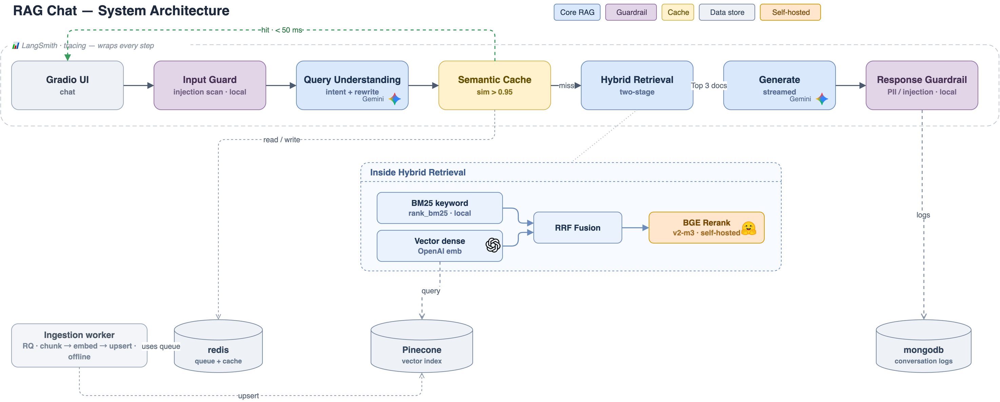
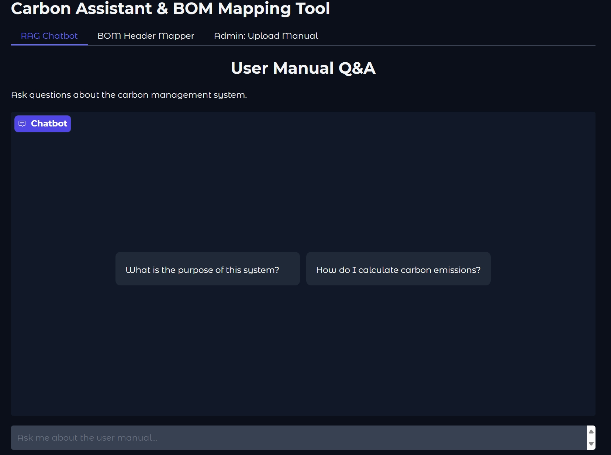
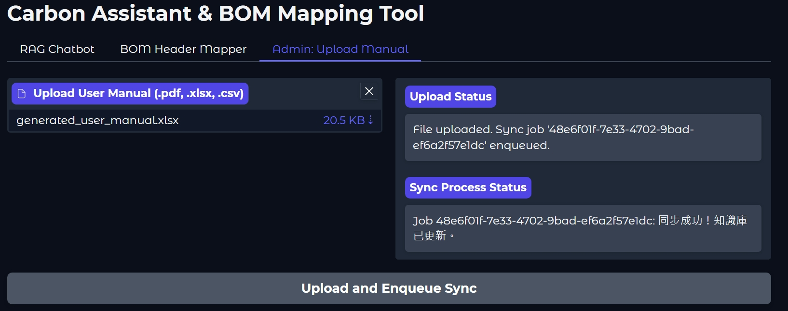

# Carbon Assistant & BOM Mapping Tool

A containerized web app with a RAG chatbot for Q&A and a smart BOM header mapping tool, built with FastAPI, Gradio, and Docker.

---

## ✨ Features

- **Conversational AI**: An advanced RAG chatbot that answers questions about a carbon management system, based on a knowledge base built from user manuals.
- **Multi-Turn Conversation**: Intelligent query rewriting and conversation history context, enabling natural follow-up questions like "4.2 呢？" after discussing "類別 4.1 排放".
- **Intent Classification**: Intelligent filtering that identifies off-topic questions before retrieval, saving costs and improving user experience with helpful guidance.
- **Streaming Responses**: The chatbot provides answers token-by-token, offering a real-time, interactive user experience.
- **Intelligent BOM Mapping**: A hybrid tool that uses a combination of rule-based matching, fuzzy string matching, and Large Language Models (LLM) to map BOM file headers to a standardized format.
- **Asynchronous Task Processing**: Utilizes **Redis Queue (RQ)** to manage heavy background tasks (like knowledge base synchronization), ensuring the web UI remains responsive at all times.
- **Multi-Format File Handling**: The knowledge base can be updated by uploading various file formats, including `.pdf`, `.xlsx`, and `.csv`.
- **Gradio Modern Web UI**: A clean, user-friendly interface for seamless interaction with the AI assistant and mapping tools.
- **Prompt Caching**: Semantic similarity caching (powered by Redis) that reduces API costs and improves response times by up to 80% for similar questions.


---

## 💡 Key Technical Highlights

- **Intent Classification Layer**: Uses **Gemini 2.5 Flash** to filter off-topic questions before retrieval (95%+ accuracy, <400ms latency, ~$0.0001/query).
- **Query Rewriting**: Automatically rewrites follow-up questions into standalone queries using LLM, enabling accurate retrieval for contextual multi-turn conversations.
- **Response Guardrail**: Multi-layer protection including input injection detection and PII/injection scanning on responses.
- **Asynchronous Task Queue**: Uses **Redis Queue (RQ)** to run heavy tasks (e.g., knowledge base sync) in a background `worker` process, ensuring a responsive UI.
- **Hybrid BOM Mapping**: A 3-stage process (rules, fuzzy matching, and LLM-based classification) provides highly accurate header mapping.
- **Efficient Vector Sync**: Performs an incremental sync with **Pinecone**, only updating new or changed data instead of full rebuilds.
- **Dual AI Model Strategy**: Uses **OpenAI** for high-quality embeddings and **Google Gemini 2.5 Flash** for fast, versatile chat and data analysis.
- **Semantic Cache Layer**: Implemented a cosine-similarity based cache in Redis to intercept similar questions, significantly decreasing latency and token consumption.
- **Conversation Logging**: All conversations are persisted to **MongoDB** with metadata including response source, intent classification, and cache hit status.
- **Observability**: Full tracing via **LangSmith** across the RAG pipeline (intent classification, reranking, retrieval, and generation).


---

## 🛠️ Core Technology Stack

- **Backend**: FastAPI
- **Web UI**: Gradio
- **Vector Database**: Pinecone
- **AI Models**: OpenAI (Embeddings), OpenRouter (Gemini 2.5 Flash for chat)
- **Reranking**: BGE Reranker v2-m3 (HuggingFace Cross-Encoder)
- **Observability**: LangSmith
- **Conversation Storage**: MongoDB
- **Task Queue**: Redis Queue (RQ)
- **Message Broker**: Redis
- **Containerization**: Docker & Docker Compose

---

## 🏗️ System Architecture

The system uses a decoupled architecture orchestrated by Docker Compose:

- **`web`**: FastAPI/Gradio UI. Enqueues jobs to Redis.
- **`redis`**: Message broker holding the task queue and semantic cache.
- **`worker`**: Background RQ worker that executes heavy tasks.
- **`mongodb`**: Conversation logging database.
- **`mongo-express`**: Web-based MongoDB admin GUI (port 8081).
- **`redis-insight`**: Redis GUI for inspecting the prompt cache (port 8001).



👉 **[查看完整 RAG 架構圖](architecture.md)**

---

## 🚀 Getting Started

### Prerequisites

- Docker and Docker Compose
- Git

### 1. Environment Setup

Clone the repository and create a `.env` file in the project root:

```
OPENAI_API_KEY="your_openai_api_key_here"
PINECONE_API_KEY="your_pinecone_api_key_here"
GOOGLE_API_KEY="your_google_api_key_here"
OPENROUTER_API_KEY="your_openrouter_api_key_here"

# Access control (see "Access Control" below)
APP_API_KEY="a_long_random_string_you_choose"   # shared key for /login + X-API-Key
AUTH_ENABLED=true                               # set false for local dev / tests
RATE_LIMIT_RPM=60                               # per-key requests per minute
SESSION_TTL_SECONDS=86400                        # /login session lifetime (24h)

# Optional: LangSmith observability
LANGCHAIN_TRACING_V2=true
LANGCHAIN_API_KEY="your_langchain_api_key_here"
LANGCHAIN_PROJECT="carbon-assistant"
```

### Access Control

The app gates every route behind a shared **API key** (no per-user accounts):

- **Browser**: first visit to `/` redirects to `/login`; enter the `APP_API_KEY`
  value. A Redis-backed session token is issued as an HttpOnly `session_id`
  cookie (valid for `SESSION_TTL_SECONDS`). The raw key is never stored in the
  cookie. `/logout` revokes the session immediately.
- **Programmatic**: send `X-API-Key: <APP_API_KEY>` header.
- Requests exceeding `RATE_LIMIT_RPM` per key get `429` with `Retry-After`.
- `GET /health` is exempt (for Cloud Run liveness probes).
- **Local dev / tests**: set `AUTH_ENABLED=false` (or leave `APP_API_KEY`
  empty) to bypass auth — a startup warning is logged.

On **GCP**, the Cloud Run Service is closed by default
(`allowed_invoker_members=[]` in Terraform). Operators must explicitly list
members (e.g. `"user:demo@example.com"`) or temporarily set `["allUsers"]` and
rely on the app-layer API key. `APP_API_KEY` is read from Secret Manager.

### 2. Launch the Application

```bash
docker-compose up --build
```

### 3. Access the Tools

- **Main Application**: [http://localhost:8000](http://localhost:8000) — you will
  be redirected to `/login` on first visit (enter `APP_API_KEY`).
- **Redis GUI (RedisInsight)**: [http://localhost:8001](http://localhost:8001) - Use this to inspect the prompt cache.
- **MongoDB GUI (Mongo Express)**: [http://localhost:8081](http://localhost:8081) - Use this to inspect conversation logs.

---

## 📊 RAG Evaluation (RAGAS)

The end-to-end RAG pipeline is evaluated offline with [RAGAS](https://docs.ragas.io/). Evaluation reuses the project's existing OpenRouter LLM and OpenAI embeddings as the judge — no new model provider.

### Metrics

| Metric | Needs `ground_truth`? | Measures |
| --- | --- | --- |
| `faithfulness` | No | Is the answer grounded in the retrieved contexts (no hallucination)? |
| `answer_relevancy` | No | Does the answer actually address the question? |
| `context_precision` | Yes | Are the retrieved contexts relevant (not padded with noise)? |
| `context_recall` | Yes | Did retrieval find everything the reference answer needs? |

### How to run

```bash
# 1. (Optional) Generate a draft golden set from the knowledge-base sources.
#    Questions are paraphrased by the LLM; ground_truth is the source answer verbatim.
#    Output is a DRAFT — review and edit it, then copy it to tests/rag_eval_data.json.
python -m tests.generate_rag_eval_data --n 10   # writes tests/rag_eval_data.draft.json

# 2. Run the evaluation against tests/rag_eval_data.json.
python -m tests.evaluate_rag
```

Requires `OPENROUTER_API_KEY` and `OPENAI_API_KEY`. Results print as a per-metric table and are written to `tests/rag_eval_report.json`; the command exits non-zero if any metric falls below its threshold (default `0.70`, overridable per metric via `RAG_EVAL_MIN_<METRIC>`, e.g. `RAG_EVAL_MIN_FAITHFULNESS=0.8`).

### Evaluation timing

RAGAS is **post-hoc and offline** — it scores the pipeline's outputs and is never on the live chat request path. The order is:

```
build knowledge base → generate golden-set draft → human review → (change pipeline) → run pipeline to collect samples → RAGAS scoring → threshold gate
```

A metric can only be scored once its sample is complete: context metrics need retrieval to have finished, answer metrics need generation to have finished. The evaluator collects every `{question, contexts, answer, ground_truth}` sample first, then scores them in one pass.

### Reading the scores against a baseline

Use the metrics as a **regression guard** when changing retrieval, reranking, prompts, or models:

1. **Record a baseline** — run the evaluation before your change and note the scores.
2. **Keep the golden set fixed** — `tests/rag_eval_data.json` must stay the same across a comparison, otherwise score changes can't be attributed to the pipeline change.
3. **Watch the trend, not the decimals** — the LLM judge is non-deterministic, so scores wobble by a few hundredths between runs. Look for clear up/down movement; run 2–3 times and average if you need a tighter read.
4. **Refresh the golden set when the corpus changes** — if you update the sources under `uploaded_files/`, the old `ground_truth` may be stale; regenerate and review the golden set instead of reusing it.

---

## 🕹️ UI Demo

The UI has three tabs: RAG Chatbot, BOM Header Mapper, and Admin: Upload Manual.





---

## 📦 Updating Dependencies

Dependencies are pinned for reproducible builds. Two files govern them:

- **`requirements.in`** — the human-maintained source: direct dependencies,
  optionally with range constraints. Edit this when adding or upgrading a
  package. Four packages keep their existing ranges
  (`sentence-transformers>=2.3,<6`, `huggingface_hub>=0.20,<1`,
  `ragas>=0.2,<0.3`, `datasets>=2.14`) so `pip-compile` can pick the latest
  resolvable version within each range.
- **`requirements.txt`** — the **lock file**, generated by
  `pip-compile --generate-hashes`. Every package (direct + transitive) is
  pinned to `==<version>` with `--hash` annotations. **Never hand-edit this
  file** — it will be overwritten on the next recompile.

### Recompile flow

```bash
# 1. Edit requirements.in (add/upgrade/remove a package)
# 2. Regenerate the lock file
bash scripts/compile_requirements.sh
# 3. Commit both files
git add requirements.in requirements.txt && git commit
```

The Dockerfile installs via `pip install --require-hashes -r requirements.txt`,
so any hash mismatch (e.g. a tampered or silently-replaced package) aborts the
build. To install `pip-tools` locally: `pip install pip-tools`.

