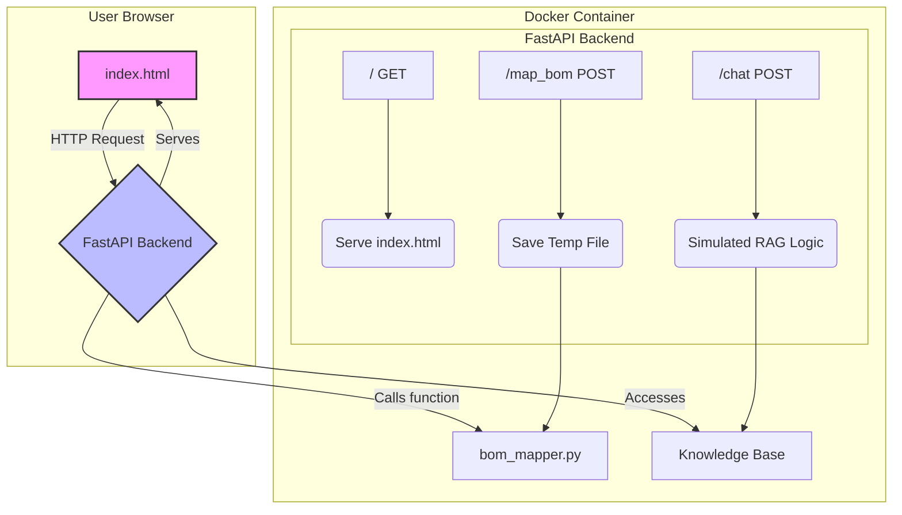

# Carbon Management Assistant Chatbot

This project is a web-based intelligent assistant designed for a carbon management system, fulfilling the requirements of the interview homework. It features a RAG-based chatbot for answering user manual questions and a utility to automatically map Bill of Materials (BOM) file headers to predefined system fields.

This application is built with Python, FastAPI, and a simple HTML/JavaScript frontend. The entire environment is containerized with Docker for consistency and ease of deployment.

---

## System Architecture

Below is the architecture diagram for the application. You can copy the code into a Mermaid-compatible viewer (like the Mermaid Live Editor) to see the visual diagram.



---

## How to Run the Application

**Prerequisites:**
- You must have Docker and Docker Compose installed and running on your system.

**Step 1: Start the Application**

Open your terminal or command prompt, navigate to the project directory (`C:\Users\User\Downloads\homework\homework`), and run the following command. This command will automatically build the Docker image and start the application container.

```bash
docker-compose up --build
```

**Step 2: Access the Application**

Open your web browser and navigate to:

[http://localhost:8000](http://localhost:8000)

You should now see and be able to interact with the Carbon Management Assistant web application.

---

## How to Use

1.  **Chat Assistant**:
    - Type a question in English or Chinese into the chat input box (e.g., "How do I log in?" or "如何重設密碼?").
    - Click "Send" or press Enter.
    - The assistant will respond based on its knowledge base.

2.  **BOM Header Mapper**:
    - Click the "Choose File" button and select a BOM file in `.csv` format (you can use the provided `test_bom.xlsx.csv`).
    - Click the "Map Headers" button.
    - The mapping results will be displayed in the results box below, showing how your file's headers correspond to the system's fields.
