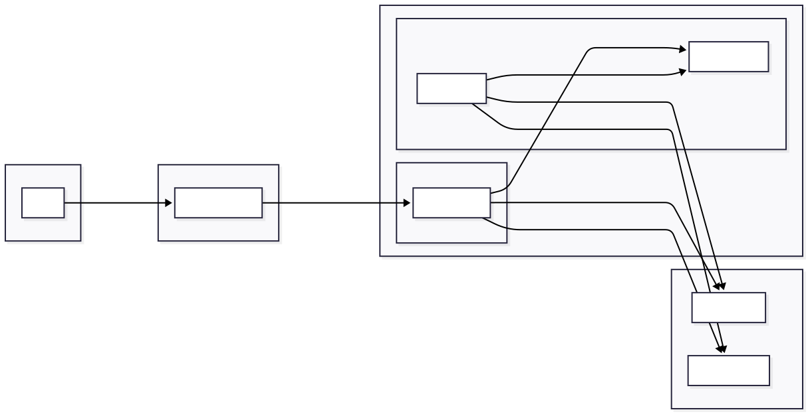

# RAG_DEMO

一個容器化的 Web 應用，內建 Agentic RAG 聊天機器人，兼具碳管理專業知識與通用問答能力。正式介面採 React + TypeScript，FastAPI 提供同源 API 與靜態成品。

---

## 如何啟動專案

### 事前準備

- Docker 與 Docker Compose
- Git

### 1. 環境設定

Clone 專案後，在根目錄建立 `.env` 檔案（完整項目請參考 `.env.example`）：

```
OPENAI_API_KEY="your_openai_api_key_here"
PINECONE_API_KEY="your_pinecone_api_key_here"
OPENROUTER_API_KEY="your_openrouter_api_key_here"

# 存取控制
APP_API_KEY="a_long_random_string_you_choose"   # 共用金鑰，用於 /login 及 X-API-Key
AUTH_ENABLED=true                               # 本機開發/測試可設為 false
```

### 2. 啟動應用程式

```bash
docker compose up --build
```

### 3. 存取服務

- **主應用程式**：[http://localhost:8000](http://localhost:8000)，首次造訪會顯示登入頁，輸入 `APP_API_KEY` 即可登入。
- **Redis 管理介面（RedisInsight）**：[http://localhost:8001](http://localhost:8001)，用於檢視 prompt cache。
- **MongoDB 管理介面（Mongo Express）**：[http://localhost:8081](http://localhost:8081)，用於檢視對話紀錄。

---

## 專案介紹

- **Agentic RAG**：結合碳管理專業知識與通用問答能力的智慧助手，透過混合路由自動判斷查詢是否需要知識庫檢索。
- **多輪對話**：智慧查詢改寫與對話歷史脈絡，讓使用者能自然地追問，例如在討論「類別 4.1 排放」後接著問「4.2 呢？」。
- **混合路由（Hybrid Router）**：兩階段路由 — 規則層（零延遲，關鍵字/模式匹配）+ LLM 結構化輸出（僅處理不確定的查詢），自動決定走 RAG 檢索或直接生成。
- **自省式檢索（Self-Reflective Retrieval）**：透過 reranker 分數評估檢索品質，品質不足時自動改寫查詢並重試，確保回答基於高品質上下文。
- **串流回覆**：完成生成與輸出檢查後，以 typed NDJSON 分段傳送回答，分開呈現狀態、來源和耗時。
- **非同步任務處理**：使用 **Redis Queue (RQ)** 管理知識庫同步等耗時的背景任務，確保網頁介面隨時保持回應速度。
- **多格式檔案支援**：知識庫可透過上傳 `.pdf`、`.xlsx`、`.csv` 等多種格式的檔案來更新。
- **手機優先 React 介面**：獨立登入、串流聊天、來源展開、對話清除、文件上傳與工作狀態，支援安全區與深色模式。
- **語意快取（Prompt Caching）**：以 Redis 實作的語意相似度快取，針對相似問題可降低 API 成本；實際效果依查詢與快取命中情況而定。

---

## 技術亮點

- **混合路由**：兩階段路由架構 — 規則層以關鍵字/正則表達式零延遲處理明確查詢（碳管理關鍵字 → RAG，一般問答模式 → 直接生成），僅不確定的查詢交由 **Gemini 2.5 Flash** 以結構化輸出判斷路由並同時改寫查詢。
- **自省式檢索**：以 reranker top-1 分數評估檢索品質，低於門檻時自動呼叫 LLM 改寫查詢並重試（最多 1 次），確保生成回答基於高品質上下文。
- **查詢改寫**：透過 LLM 自動將追問改寫為獨立問題，讓多輪對話的檢索結果更準確。規則路由命中時僅執行改寫（不重複路由），LLM 路由則在單次呼叫中同時完成路由與改寫。
- **Hybrid Search**：BM25 關鍵字檢索與向量語意檢索並行，以 Reciprocal Rank Fusion（RRF）融合排序結果，再送入 Reranker 精排，兼顧精確專有名詞命中與語意相關性。
- **回覆防護（Guardrail）**：多層防護機制，包含輸入端的 prompt injection 偵測與輸出端的 PII/injection 掃描。
- **非同步任務佇列**：使用 **Redis Queue (RQ)** 將知識庫同步等耗時任務丟到背景 `worker` 執行，確保介面保持回應速度。
- **高效向量同步**：對 **Pinecone** 執行增量同步，只更新新增或變動的資料，而非每次全量重建。
- **語意快取層**：以餘弦相似度為基礎，在 Redis 中實作快取層，攔截相似問題以大幅降低延遲與 token 消耗。
- **對話紀錄**：所有對話都會連同回覆來源（rag/direct/cache/guardrail）、快取命中狀態等中繼資料一併存入 **MongoDB**。
- **可觀測性**：透過 **LangSmith** 對 RAG pipeline 的路由決策、查詢改寫、檢索品質評估、重試改寫、生成等關鍵步驟進行追蹤。

---

## 系統架構

系統採用 Docker Compose 編排的解耦架構：

- **`web`**：FastAPI 提供 `/api/v1/*`、NDJSON 聊天串流及 React 靜態成品。
- **`redis`**：訊息代理，同時承載任務佇列與語意快取。
- **`worker`**：背景 RQ worker，執行耗時任務。
- **`mongodb`**：對話紀錄資料庫。
- **`mongo-express`**：MongoDB 管理介面（port 8081）。
- **`redis-insight`**：Redis 管理介面，用於檢視 prompt cache（port 8001）。



---

## 前端開發與驗證

正式 Docker image 會在 Node build stage 執行前端建置，runtime 只保留 Python 與 `frontend/dist`。需要單獨開發介面時：

```bash
cd frontend
corepack enable
pnpm install --frozen-lockfile
pnpm dev
```

Vite 會把 `/api` 與 `/health` proxy 到 `http://localhost:8000`。前端檢查：

```bash
pnpm lint
pnpm typecheck
pnpm exec vitest run --maxWorkers=1
pnpm build
```

Python source 開發可使用：

```bash
docker compose -f docker-compose.yml -f docker-compose.dev.yml up --build
```

Dev override 只掛載 `src`，不覆蓋 image 內的 `frontend/dist`；Python 修改後重啟 web/worker。前端修改需 Vite dev server 或重新 build image。web/worker 共用 `manual_data` 與 `bm25_data` volumes，讓背景 worker 能讀取已上傳文件，web 能載入更新後的 BM25 index。移除 volumes 會清除這些本機資料。

主要 API：

- `GET /api/v1/auth/session`、`POST /api/v1/auth/login`、`POST /api/v1/auth/logout`：session bootstrap、登入與撤銷。
- `POST /api/v1/chat/stream`：`application/x-ndjson` 串流事件。
- `GET|DELETE /api/v1/conversations/current/messages`：目前 session 的短期對話。
- `POST /api/v1/admin/manuals`、`GET /api/v1/admin/jobs/{job_id}`：上傳手冊與查詢同步狀態。

## Side project 範圍

- 使用共用 `APP_API_KEY`，同一底層 key 共用預設 60 RPM，不含多帳號與 RBAC。
- Redis 對話脈絡閒置 30 分鐘後過期；清除目前對話不會刪除 MongoDB 稽核紀錄、prompt cache 或 LangSmith trace。
- 「停止」會立即停止瀏覽器接收；已在後端完成的回答仍可能完成保存，不保證強制取消模型工作。
- 部署維持單一 Cloud Run instance，尚未宣稱高併發容量；擴大公開使用前需另做壓測與背壓設計。
- 所有登入者皆可使用管理上傳；預設 `MAX_UPLOAD_BYTES=26214400`（25 MB）。上傳包含副檔名/MIME/大小/路徑基本驗證，但不含惡意檔案掃描、RBAC 或完整 PII/DLP 治理。
- 停止接收保留目前顯示的文字並標示未完成；未保存的內容不保證重新整理後存在。已送出的 provider 請求不保證立即停止計費。
- 單程序會以 session 防止重複聊天／清除衝突（409）；不提供跨 instance 鎖。
- 手機中文鍵盤開啟時收起底部分頁與建議問題，輸入區跟隨 VisualViewport；關閉後恢復。主題跟隨系統深淺模式。

## 前端驗收

元件與 parser 測試：`cd frontend && pnpm exec vitest run --maxWorkers=1`。完整驗收證據與尚未完成項目見 `openspec/changes/archive/2026-10-03-replace-gradio-frontend/validation.md`。

瀏覽器驗收腳本 `frontend/e2e/acceptance.mjs` 使用 Playwright 與本機 Chrome，mock API，不會呼叫真實 LLM 或提交真實上傳。先建置前端，再從 `frontend/dist` 啟動本機靜態 server（預設 `http://127.0.0.1:18173`）。在有 Playwright 的環境執行 `node frontend/e2e/acceptance.mjs`；也可用 `PLAYWRIGHT_MODULE_PATH` 指向現有 Playwright 的 `index.mjs`。`ACCEPTANCE_URL` 可指定測試 URL，`ACCEPTANCE_OUTPUT` 可指定截圖目錄。

Docker smoke test 使用 image 內的 Python 與 fake chat/job provider：

```bash
docker build -t rag-react-acceptance .
docker run --rm --mount type=bind,source="$PWD/scripts/frontend_docker_smoke.py",target=/tmp/frontend_docker_smoke.py,readonly rag-react-acceptance python /tmp/frontend_docker_smoke.py
```

`frontend/e2e/socket-acceptance.mjs` 可對 `scripts/phone_acceptance.py` 的隔離同源測試站執行真實 HTTP cookie/history/abort/upload 流程（fake provider/job、記憶體資料）。指定 `ACCEPTANCE_URL` 與相同 Playwright 路徑即可重跑；測試站登入 key 僅供測試使用，不能部署為正式服務。

`scripts/real_rag_smoke.py` 提供需明確授權的真實 provider 單人／兩人測試。授權前不執行；caller 私下提供 credentials，設 `ALLOW_LIVE_RAG_SMOKE=true`，不把 key 寫入命令、log 或 commit。腳本停用 cache、tracing 與 history/Mongo 寫入，僅輸出耗時、回答長度與來源數。

這些自動化測試不取代實際手機虛擬鍵盤、真實 provider 容量或正式 Cloud Run revision 的切換與 rollback 驗收。

## 部署

Cloud Run revision 驗證、正式流量切換與回復指令見 [部署手冊](docs/deployment/replace-gradio-frontend.md)。正式環境使用 React SPA 與 `JOB_RUNNER=gcp`，web 與 sync job 共用 GCS 掛載的 `DATA_SOURCE_DIR`/`BM25_INDEX_DIR`；模型快取 `MODEL_CACHE_DIR` 保留 image 內路徑。`GCP_PROJECT_ID`、`GCP_REGION`、`SYNC_JOB_NAME` 指定背景 job。

其他環境變數與預設值見 `.env.example`，包括 `RATE_LIMIT_RPM`、`SESSION_TTL_SECONDS`、`CHAT_HISTORY_TTL_SECONDS`、`CHAT_HISTORY_MAX_TURNS`。正式部署必須設定共用登入 key；HttpOnly session cookie 在 HTTPS 下使用 Secure，變更 API 使用同源 Origin/Referer 驗證。

React 已於 2026-10-03 正式上線，實體手機驗收完成。新程式不再包含 Gradio；舊 Cloud Run revision/image 保留供回復，無須在新版本重新啟用舊介面。
