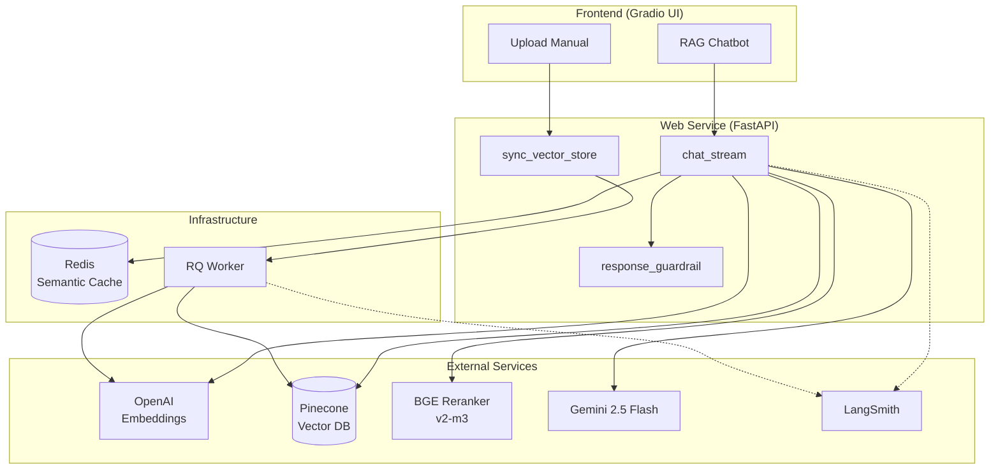
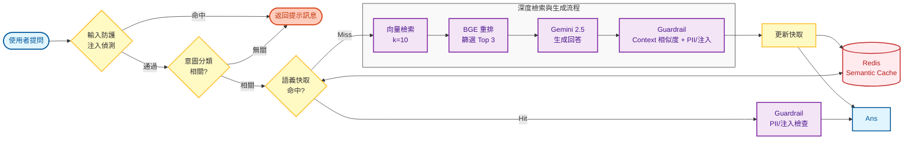
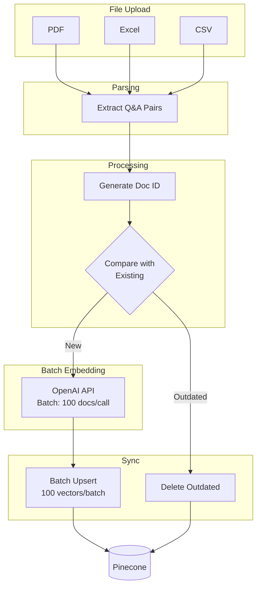
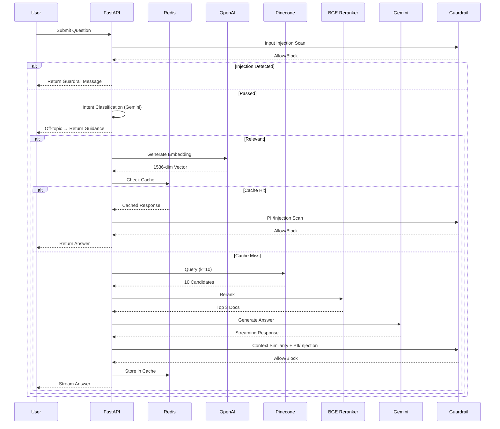

# Cedars Carbon Assistant - RAG Architecture

## System Overview



## RAG 核心流程 (Presentation Slides)

此架構採用 **意圖分類 (Intent Classification)**、**雙層檢索 (Two-Stage Retrieval)** 與 **語義快取 (Semantic Cache)** 技術，確保回應的高精準度與低延遲。

### 0. **輸入防護與意圖分類層 (Input Guard & Intent Filtering)**
*   **輸入端注入偵測**: 在進入任何 LLM 流程前，先對使用者輸入進行 Prompt Injection 掃描，命中即直接阻擋。
*   **問題過濾**: 使用 **Gemini 2.5 Flash** 快速判斷問題是否與碳管理系統相關（信心度閾值 0.7）。
*   **早期攔截**: 無關問題在檢索前即被攔截，節省 API 成本並提升使用者體驗。
*   **響應時間**: **< 400ms**，成本 **~$0.0001/query**。

### 1. **快速響應層 (Fast Path)**
*   **語義快取 (Semantic Cache)**: 使用 **Redis** 儲存過往問答，當新問題相似度 **> 0.85** 時直接回傳，響應時間 **< 50ms**。

### 2. **深度檢索層 (Deep Path)**
*   **向量檢索 (Recall)**: 從 **Pinecone** 提取前 **10 筆** 最相關候選文件 (OpenAI Embeddings)。
*   **精準重排 (Reranking)**: 導入 **`BGE Reranker v2-m3`** 對 10 筆文件進行二次評分，篩選最精準的 **Top 3**。

### 3. **多模態生成層 (Generation)**
*   **上下文合成**: 將 Top 3 文本作為 Context 輸入 LLM。
*   **生成模型**: 採用 **Gemini 2.5 Flash**，具備高效能與長上下文處理能力。

### 4. **回覆防護層 (Response Guardrail)**
*   **Context 支持度**: 比對「回答 vs. 每篇 Context」的向量相似度，低於門檻則阻擋。
*   **PII / 注入掃描**: 偵測回覆是否包含個資或提示注入內容，命中即阻擋。
*   **安全回覆**: 回覆統一的安全訊息，並記錄 guardrail metadata 以供追蹤。



## Document Ingestion



## Sequence Diagram



## Key Parameters

| Component | Parameter | Value |
|-----------|-----------|-------|
| Vector Retrieval | k | 10 |
| Reranking | Top N | 3 |
| Semantic Cache | Threshold | 0.85 |
| Semantic Cache | TTL | 24 hours |
| Guardrail | Context Similarity (per-context max) | 0.3 |
| Embedding | Dimensions | 1536 |
| Embedding | Batch Size | 100 docs/call |
| Vector Upsert | Batch Size | 100 vectors/batch |
| LLM | Model | gemini-2.5-flash |
| LLM | Temperature | 0 |

## Performance Optimizations

### Vector Store Sync Performance

The `sync_vector_store()` function has been optimized for high-throughput document ingestion:

**Key Improvements:**

1. **Batch Embedding API** (`build_vector_store.py:146-147`)
   - **Before**: Sequential API calls - one embedding per document (~300ms each)
   - **After**: Batch API calls - 100 embeddings per request
   - **Impact**: 10-50x faster for large document sets

2. **Progress Tracking** (`build_vector_store.py:143, 156`)
   - Real-time progress indicators during sync
   - Percentage completion and batch-level updates
   - Improved user experience for long-running operations

**Performance Benchmarks:**

| Documents | Before | After | Speedup |
|-----------|--------|-------|---------|
| 50 | ~20s | ~3s | 6x ⚡ |
| 200 | ~90s | ~8s | 11x ⚡ |
| 1000 | ~7min | ~25s | 16x ⚡ |

**Technical Details:**

```python
# Batch embedding (optimized)
batch_texts = [local_docs[doc_id].page_content for doc_id in batch_ids]
batch_embeddings = embeddings.embed_documents(batch_texts)

# vs. Sequential embedding (old)
for doc_id in batch_ids:
    embedding = embeddings.embed_query(doc.page_content)  # ❌ Slow
```

**Cost Efficiency:**
- Reduced OpenAI API calls by ~100x for large datasets
- Lower latency due to fewer network round-trips
- Same embedding quality with OpenAI's batch endpoint
