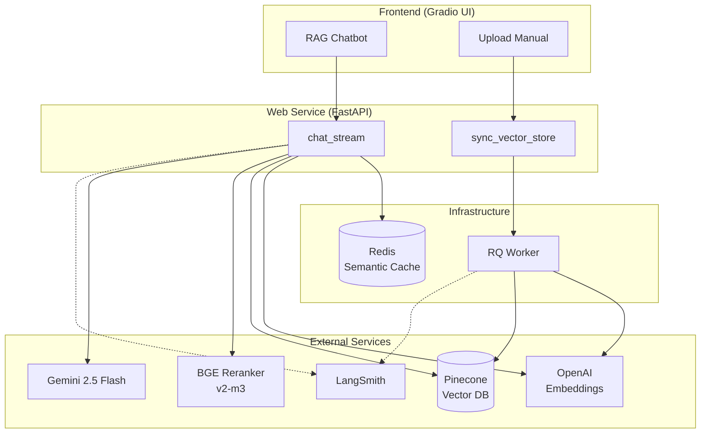
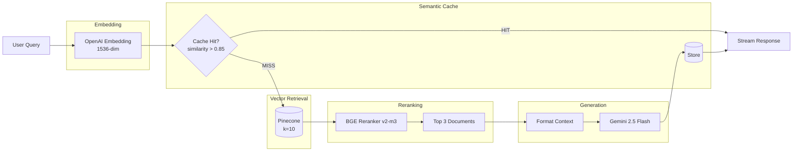
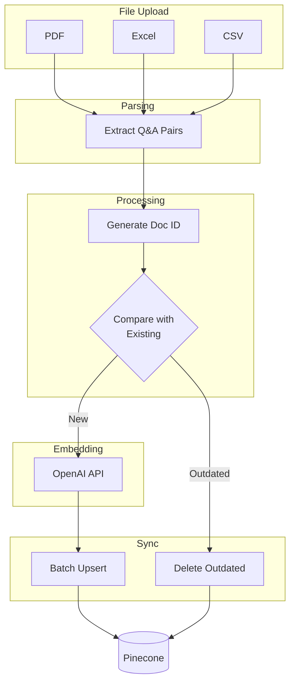
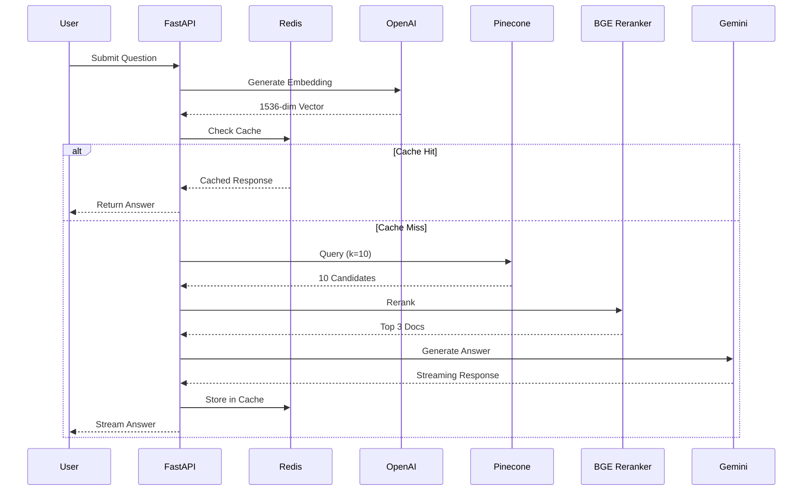

# Cedars Carbon Assistant - RAG Architecture

## System Overview

## RAG Pipeline

## Document Ingestion

## Sequence Diagram

## Key Parameters

| Component | Parameter | Value |
|-----------|-----------|-------|
| Vector Retrieval | k | 10 |
| Reranking | Top N | 3 |
| Semantic Cache | Threshold | 0.85 |
| Semantic Cache | TTL | 24 hours |
| Embedding | Dimensions | 1536 |
| LLM | Model | gemini-2.5-flash |
| LLM | Temperature | 0 |
