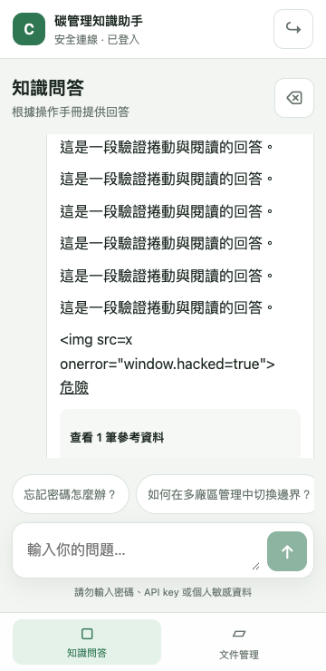
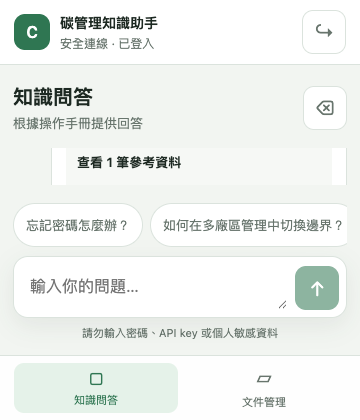
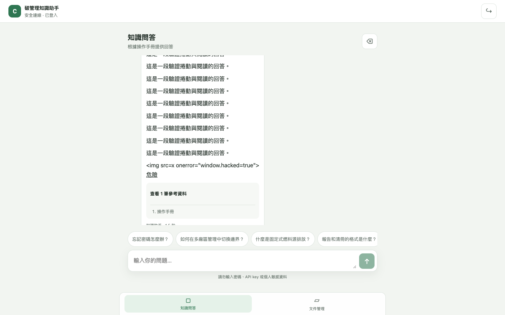
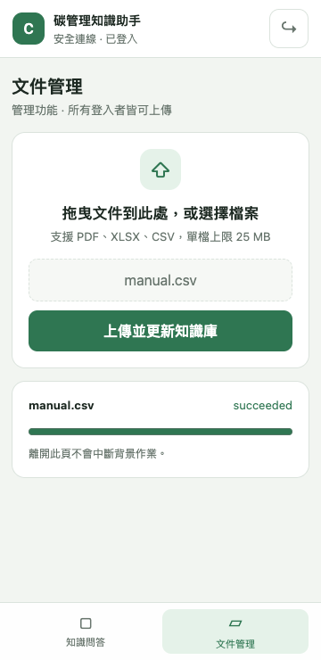

# 前端替換驗收 — 2026-10-01

## 最新結論（2026-10-02）

自動化功能、安全、版面、同源 socket 與最新 image 驗收通過。Checklist **33/37**；尚待真實 provider 授權測試、完整手機逐項确认與 Cloud Run 切換/回復，Gradio 移除依切換驗收後執行。PR 尚無外部 review，未合併、未封存、未切換正式流量。

下列較早紀錄保留為執行歷史，最新結果以本節與文末 2026-10-02 補充為準。

## 驗證證據

| 檢查 | 結果與範圍 |
| --- | --- |
| 前端元件與 API/parser | 21 tests passed；`pnpm exec vitest run --maxWorkers=1` |
| TypeScript / Vite | `pnpm build` 通過；JS 386.79 kB，gzip 118.97 kB；CSS 8.49 kB，gzip 2.46 kB |
| 完整後端回歸 | 233 passed / 2 deselected；獨立 Docker 容器 bind mount 此 branch，`pytest -q -p no:cacheprovider -m 'not integration'`；未使用真實 provider credentials |
| 最後上傳安全修正 | `tests/test_manual_service.py` + `tests/test_frontend_acceptance.py`：20 passed，包含新增的 3 個 traversal case；這是修正後的針對性回歸，未宣稱另跑完整 236 tests |
| Playwright / Chrome | 360×740、360×420、1440×900 的 3 組完整 journey 通過；fake API；最後版面修正後重跑通過 |
| Docker image | `docker build -t rag-react-acceptance:20261001 .` 通過；Python/model/dictionary/dependency 層沿用 build cache，frontend stage 重建；image SHA `59a77177f35a51f528e507a572dd3b8a41f90d1e459a4945b7fc3e23f2b9515f` |
| Built-image smoke | `scripts/frontend_docker_smoke.py` 通過；同 image 的編譯 SPA/assets、deep links、health、API 404、typed stream、2000/2001 字、兩個 fake requests、upload/job/413/422/traversal，以及無 Node executable / node_modules |
| Diff / Compose | `git diff --check` 通過；`docker compose --env-file .env.example config --quiet` 通過；僅有 GOOGLE_API_KEY 未設定警告 |

前端測試涵蓋 history restore、載入中禁止送出、清除失敗保留畫面、status/delta/sources/timing、停止接收、IME、XSS、401、登出失敗、檔案類型/大小、terminal polling、失敗後重查及 `/admin` refresh。Parser/client 測試覆蓋跨 chunk、多行、malformed/truncated line、缺少 terminal、重複 done、429 Retry-After。

後端新增測試使用 fake generation/retrieval/cache/persistence，驗證 RAG/direct/cache/guardrail 的 terminal/metadata/source contract、生成錯誤安全收尾、生成中取消不保存半成品及兩個並行 fake RAG requests。安全測試包含 cookie mutation 的合法、缺少及異源 Origin、Referer、API-key header，session 過期、JSON 401、429 Retry-After、enqueue 失敗刪檔及 job 404/503。

瀏覽器 journey 涵蓋鍵盤登入、聊天/來源/時間、長回答內部捲動、clear 503/204、truncated stream、429/401、XSS、檔案類型驗證、queued/running/succeeded polling 與登出。尺寸斷言確認無水平頁面溢出、composer/nav 留在 viewport、主要 action 至少 44×44、輸入字體 16px、桌面內容寬度不超過 760px。360×420 為縮小 viewport 模擬，**不代表實際手機虛擬鍵盤已驗收**。

## 本次修正

- History 載入期間禁止送出與清除，避免延遲 restore 覆蓋新訊息；卸載後忽略 restore 結果。
- 串流中禁止清除；clear 失敗保留 history，401 返回登入。
- Client 要求 terminal event，拒絕重複 terminal 或完成後事件；提前停止 parser 時取消 reader。
- 文件上傳/輪詢 401 返回登入；輪詢改為不重疊的 timeout，hidden page 降頻、10 分鐘逾時及手動重查。
- 登出失敗顯示錯誤並保留目前 app；穩定 unauthorized callback。
- `/admin` deep link 與 browser back/forward；管理頁說明共用權限。
- Sources/suggestions touch target、file-picker focus、長檔名換行、桌面 760px 欄寬。
- API 請求即使 Accept 包含 HTML，未授權仍回 JSON 401。
- 含 Unix/Windows 路徑的上傳檔名回 422，不保存、不 enqueue。

## 尚未完成的規格與交付

以下項目保持未勾選；不能將本次 passed checks 解讀為全部規格通過。

- 1.1 / 2.4：完整 legacy Gradio parity checklist，以及使用新 chat service 的暫時 Gradio adapter 尚未完成。
- 1.3 / 3.7：一致的完整 error schema、409 contract 與所有 controller/security 情境覆蓋尚未完成。
- 4.1 / 4.2 / 4.3：缺 lint command、React error boundary、所有 parser/client abort/401 情境測試。已有 deep-link 行為不表示整個項目完成。
- 6.1 / 6.3：缺 drag/drop，以及 poll failure/404/401/timeout 的完整元件情境集；目前涵蓋 success、503 retry 與 upload 401。
- 7.3 / 7.5：尚未完整驗證每種 Compose dev mount；fake concurrency smoke 不代表真實 RAG provider 容量或首次載入效能驗收。
- 8.1：尚未驗收實際手機、virtual keyboard 與完整 keyboard/focus journey。
- 8.2 / 8.3：正式 Cloud Run revision cutover/rollback 未執行；Gradio 及 dependency 保留，未重新產生去除 Gradio 的 lockfile。
- 8.4 / 8.5：文件已補驗收命令與截圖，但完整交付文件及包含 lint 的最終全套驗收仍待完成。
- `CLAUDE.md` 要求 PR code review 後才能合併；目前未聲稱已完成 review。

## Spectra 與執行環境限制

Spectra 3.0.0 的 `status` / `instructions apply` / `archive --preview` 找不到此 worktree 的 change，雖然 artifacts 存在。補試標準 change metadata 也沒有解決，暫時檔案已移除；未強制封存或套用 specs。此報告依 artifacts 與實際來源手動核對。

繁忙的本機環境曾使 Docker 測試等待及 Vitest worker 啟動逾時；停止該測試程序後，獨立容器測試與單 worker 前端重跑均通過。通過的 backend run 仍有 dependency deprecation 與既有未註冊 integration marker warnings。

## 截圖

截圖皆為 fake data，存於 `docs/acceptance/replace-gradio-frontend/`。

重跑方式見 README 的「前端驗收」。

## 2026-10-01 手機實測追蹤

使用者以 iPhone Safari 實測測試站，回報中文鍵盤開啟時底部分頁被推高、留下大片空白，以及深色模式露出白底。修正如下：

- App shell 依 VisualViewport 的 height/offsetTop 定位；鍵盤開啟時收起底部分頁、建議問題和提示，收起鍵盤後恢復。
- 自動捲動僅操作 thread，不再以 scrollIntoView 捲动頁面祖先。
- html 與 app shell 背景均使用主題 token，theme-color 隨深淺模式設定。
- 新增鍵盤縮高、Safari viewport 位移、恢復與縮放清理測試。前端 39 tests、lint、typecheck、production build 通過。Playwright 確認深色 html/body/shell 均為 rgb(16,20,17)，淺色均為 rgb(242,245,241)。

使用者在修正後回覆「測試ok」，確認本次手機版面與停止接收測試通過。這項確認不外推為未逐項回報的手機上傳、history clear、登入登出或正式 Cloud Run cutover 驗收。

## 最新回歸補充

2026-10-01 修正 MetadataEvent JSON alias 後，獨立 Docker 容器 bind mount 最新 branch 執行完整非 integration 回歸：**270 passed / 2 deselected**（9.58s），保留既有 dependency/marker warnings。新情境涵蓋一致 API error schema、409 session guard、transport close、Gradio adapter 四種路由 parity、檔名 collision，以及 local/GCP job status adapter。

1.1、1.3、2.4、3.7、4.1–4.3、6.1、6.3 已由新增 parity 文件、實作與後端/前端測試完成；上方較早的未完成清單是當時快照，這些項目已不再待辦。真實 provider smoke、部署切換/回復、Gradio 移除及最終整合交付仍待完成。

最新 frontend build 的 Playwright 重跑通過 360×740、360×420、1440×900 三組 journey：登入、聊天/來源、內部捲動、XSS、clear、truncated/429/401、upload/poll、登出；截圖存於 `/tmp/rag-final-acceptance`。這些為 fake API 瀏覽器回歸，與使用者手機實測證據分別記錄。

## 2026-10-02 最終本機交付驗收

| 檢查 | 最新結果 |
| --- | --- |
| Backend | 271 passed / 2 integration deselected；加入 API key + 未驗證 cookie 不能選 history 的失敗重現與回歸修正 |
| Frontend | lint、40 tests、typecheck/build 通過（含橫向旋轉不誤判鍵盤） |
| Bundle | JS 390.34 kB / gzip 120.26 kB；CSS 8.89 kB / gzip 2.57 kB |
| Mock browser journeys | 360×740、360×420、1440×900 三組通過；最新截圖已更新 docs/acceptance |
| Same-origin socket | 真實 HTTP transport + fake providers：登入/HttpOnly SameSite cookie、來源、history refresh/clear、stop abort、upload/job、logout 全部通過 |
| Keyboard geometry | Layout viewport 740px 不變，VisualViewport height 360px / offsetTop 80px；composer bottom 432px，nav 收起、恢復正確 |
| First load | 最新 image 本機 Chrome/mobile viewport DOMContentLoaded 52ms；JS transfer 390645 bytes / 8ms，CSS 9190 bytes / 6ms。僅本機 HTTP、非 production/network SLO |
| Image | `rag-react-acceptance:20261002` 最新後端／前端 image build 通過；SHA `49df42eb24bbc91d62198275ef932c4bfbfb09756658f04dde3afceccdfb7652` |
| Image smoke | 最新 image health/SPA/deep links/assets/API404/typed events/2000字邊界/fake並行/upload安全/job/Python-only runtime 通過 |
| Compose | 合併 dev config 通過；src-only mount smoke 通過；兩個獨立容器共用 temporary upload/BM25 volumes 可讀寫，assets 保留；temporary volumes 已清理 |
| Cloud | 僅讀取 describe：舊 revision `carbon-assistant-web-00014-pw9` 仍為 100%；部署/rollback 手冊完成，未執行切換 |

README 補齊 lint、固定 lockfile 開發、Compose 共用文件/index、auth API、手機鍵盤主題、Stop/clear/權限限制與部署手冊（8.4）。8.5 的要求已由最新本機全套自動驗收滿足；真實 provider、實機與部署驗收分別由 7.5/8.1/8.2 保持追蹤。

剩餘四項：7.5（真實 RAG 1/2 concurrent 等待外部 provider/data 授權）、8.1（完整手機逐項回報）、8.2（review 後候選 revision / cutover / rollback）、8.3（依 8.2 完成後移除 Gradio）。使用者已在 2026-10-01 確認鍵盤、配色與停止正常；未虛構其他實機回報。

Spectra CLI 將 linked worktree 映射至主 repo，仍無法直接找到本 change；以完整 openspec/.spectra.yaml 複製至無 git 的 temporary snapshot 執行 `status`/`validate`，schema/artifacts 與格式 valid。Analyze 無 Critical；既有 12 項 concrete-example Suggestions 保留，Compose heading/requirement 的 task matching 已對齊。沒有 archive 或修改主 repo specs；status 的 isComplete 表示 artifacts 已具備，不表示所有 tasks 完成。

真實 provider 的第一個 tool action 被自動審查拒絕，未執行、未取得或印出憑證；已詢問使用者明確授權三次問題與知識庫檢索內容送至 OpenAI/Pinecone/OpenRouter。`scripts/real_rag_smoke.py` 已準備，需 ALLOW_LIVE_RAG_SMOKE=true 且授權後才執行，資料寫入與 tracing 隔離；目前沒有 real smoke 通過證據。
